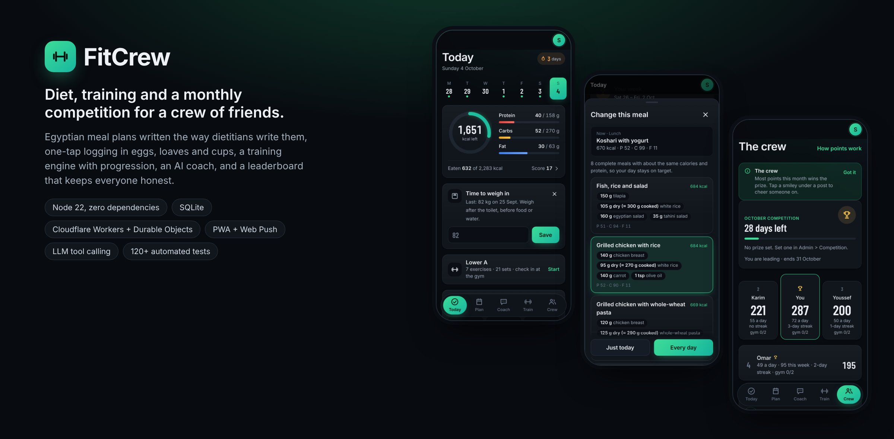
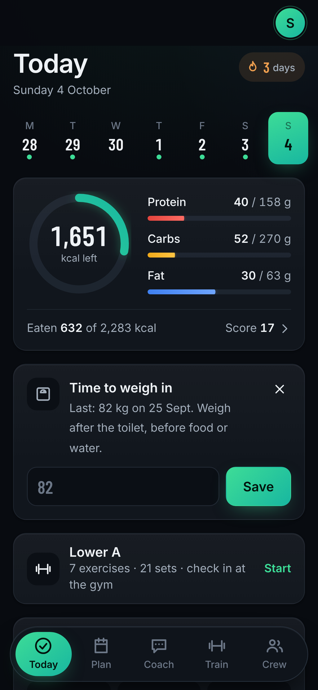
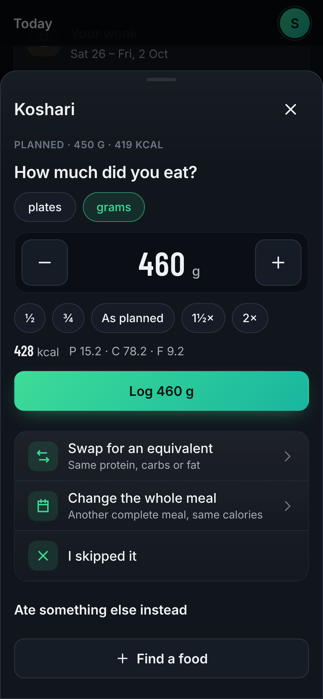
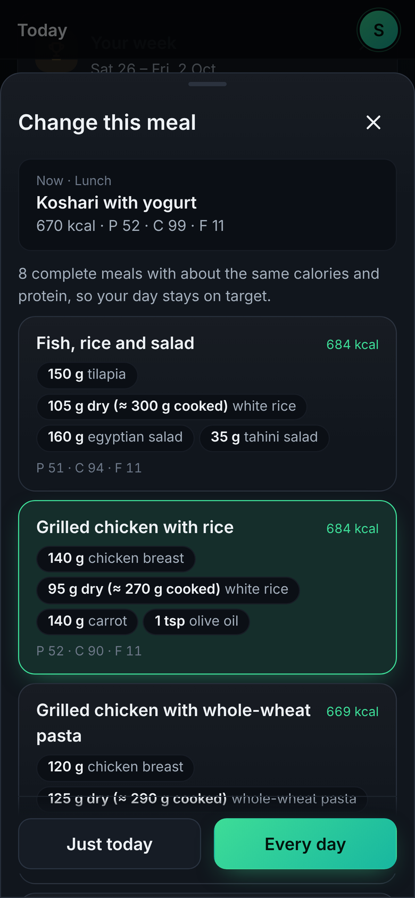
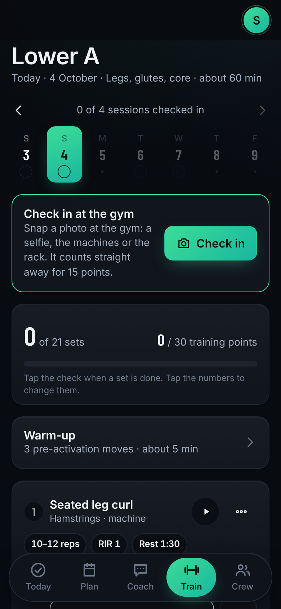
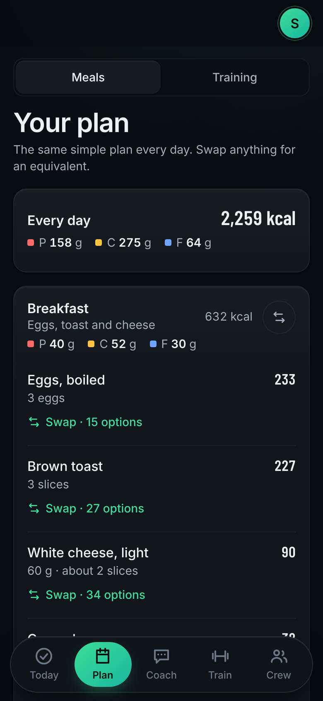
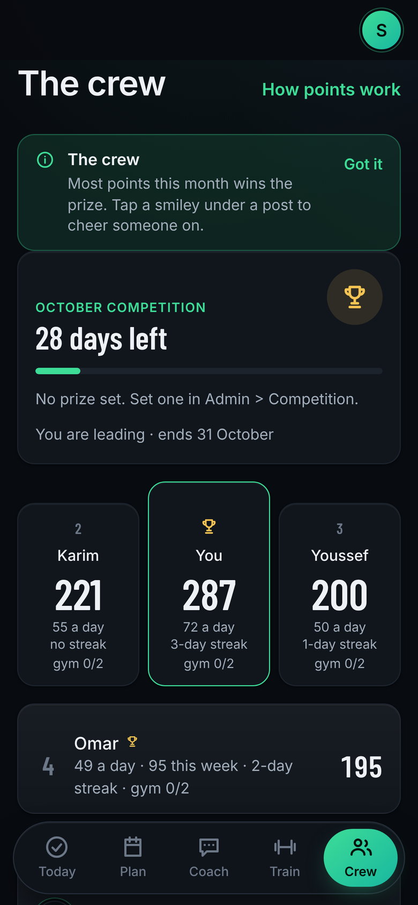
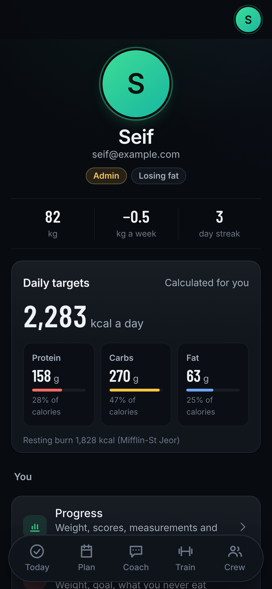
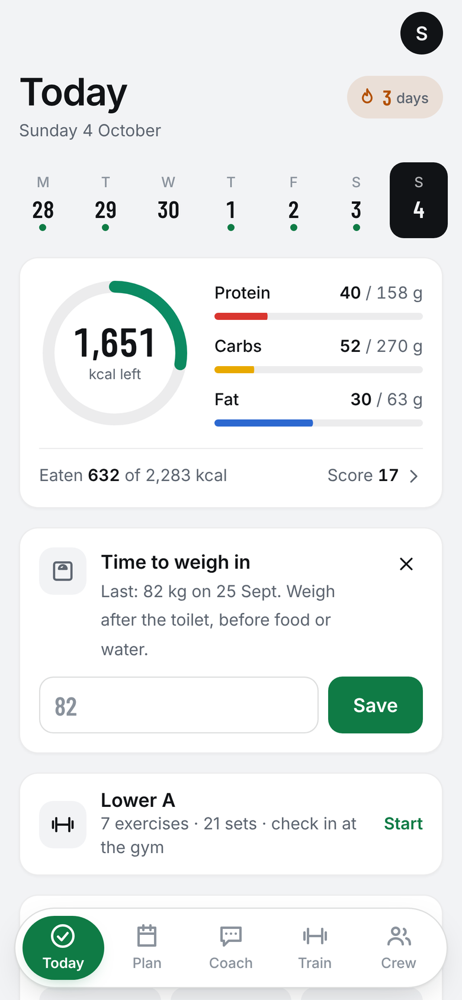

<p align="center">
  
</p>

# FitCrew

A diet and training app for a small group of friends: Egyptian meal plans written the way local dietitians write them, one-tap logging, a progressive training plan, an AI coach that acts through the app's own API, and a monthly points competition that keeps everyone consistent.

It runs as an installable PWA on the crew's phones and is hosted on Cloudflare's free plan. The whole stack is **Node 22 built-ins only**: no frameworks and no npm dependencies, on the server or in the browser.

> Private app (invite-only sign-up). This repository is the full source; the deployed instance is not public.

## Highlights

**Nutrition engine**
- Targets from Mifflin-St Jeor or Katch-McArdle (US Navy body-fat estimate), with safety rails: max 1% body weight lost per week, 25% max deficit, 1,200 / 1,500 kcal floors, protein dosed on reference weight.
- **Plan generator**: realistic Egyptian meal templates plus one bounded least-squares solve over the whole day (projected coordinate descent), so every portion stays inside a realistic serving range while the day hits kcal, protein, carbs and fat. Countable foods come in whole units (3 eggs, 1½ loaves); rice and pasta are given dry.
- **The day makes sense to a normal person**: lunch is the one cooked meal (molokhia, mahshi, stews, koshari), dinner is light and reuses lunch's protein ("cook once, eat twice"), and breakfast holds breakfast foods. A deterministic checker enforces this on every plan, including AI-proposed menus.
- **Swaps the way dietitians do them** (بدائل): any item swaps for an equivalent on its key macro, and any meal swaps for another complete meal with the same calories, for today or for good.
- **Logging in natural units**: "3 eggs", "1 plate of koshari", "1½ cups of rice", "70 g dry", with a live calorie preview. Overate? *Rebalance* trims the rest of the day within realistic portions.

**Training engine**
- Split selection (PPL, Arnold, upper/lower, anterior/posterior, full body; chosen by an LLM or rules), intensity-based set budgets, RIR and tempo, warm-ups, post-workout cardio by goal.
- Double progression with a suggested weight × reps for every set, a 7-week cycle with a deload, then the next cycle drafted automatically.
- Gym check-ins with perceptual-hash duplicate detection, a rest timer scheduled on the audio clock, and an offline queue that replays set ticks and food logs in order.

**Crew and coach**
- Daily score out of 100 (calories, protein, plan adherence, same-day logging, training), streaks, a monthly competition with a prize and hall of fame, a crew feed with reactions, weekly recaps.
- AI coach over an OpenAI-compatible API with **30+ tools** (log food, swap a meal, rebalance, log sets, change the split...). It acts *as the user* through the same routes as the app, and can never reach admin routes. Everyday messages ("log lunch", "drank 2 glasses") are parsed locally without the LLM.
- An "AI admin" auto-approves plans only when they pass deterministic safety and common-sense rules; everything else goes to a human.
- Scheduled check-ins and Web Push implemented from scratch (VAPID + aes128gcm with `node:crypto`).

## Screenshots

| Today | Log in natural units | Change a meal | Training |
|---|---|---|---|
|  |  |  |  |

| Meal plan | Crew competition | Profile | Light theme |
|---|---|---|---|
|  |  |  |  |

## Architecture

```
Browser PWA (public/)  ──►  /api/*  ──►  src/api.js (route table)  ──►  SQLite
                                         the same code runs on two hosts:
  Local:       server.js  (node:http + node:sqlite file)
  Production:  worker/index.js (Cloudflare Worker) ─► one SQLite Durable Object
               (worker/sqlite.js adapts it to node:sqlite's API)
               cron every 10 min ─► scheduled check-ins and push
```

| Path | Responsibility |
|---|---|
| `src/calc.js` | BMR, TDEE, calorie target and macros (shared with the browser) |
| `src/plan.js` | Meal templates, portion solver, day rules, whole-meal alternatives, rebalancing |
| `src/exchange.js`, `src/measures.js` | Food exchanges and household units (eggs, loaves, cups, plates) |
| `src/workout.js`, `src/api-train.js` | Exercise library, splits, progression, cycles, check-ins |
| `src/coach.js`, `src/plan-ai.js`, `src/split-ai.js` | LLM coach (tool calling), AI menu proposals, split choice; every AI output is validated |
| `src/review.js` | Deterministic plan review (the "AI admin") |
| `src/social.js`, `src/adherence.js` | Scoring, streaks, monthly competition, feed |
| `src/push.js`, `src/jobs.js` | Web Push from scratch, scheduled check-ins |
| `public/` | Vanilla ES-module front end, design tokens, light and dark themes, service worker |

**Security**: invite-only accounts, scrypt password hashes, hashed session tokens in HttpOnly SameSite cookies, a CSRF header on every write, login throttling, strict CSP, an audit log for every admin action, and private member photos. Secrets live in Cloudflare secrets, never in the repository.

## Run it

Requires **Node.js 22.13+**. Nothing to install.

```bash
npm start      # http://localhost:3000, create the admin account on first open
npm test       # 120+ tests (node:test)
```

On Windows, `start-dev.cmd` and `test.cmd` do the same with a double-click. The AI features are optional: put `FITCREW_AI_KEY=...` in a git-ignored `fitcrew.env` to enable them.

### Deploy (Cloudflare, free plan)

`deploy.cmd` signs in to Cloudflare (first time only), deploys the Worker, static assets and Durable Object, and stores the AI key as an encrypted secret. Data stays in place between deploys.

## Author

**Seif Tamer**, Computer Engineering (Digital Media Engineering), German University in Cairo. Built end to end: product design, nutrition and training logic, backend, front end and deployment.
